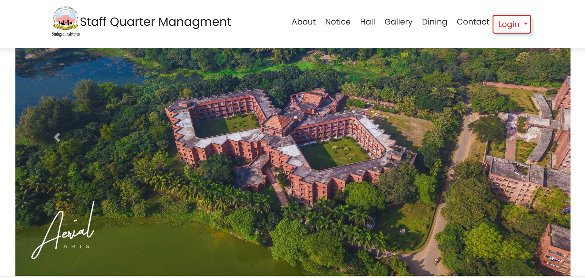
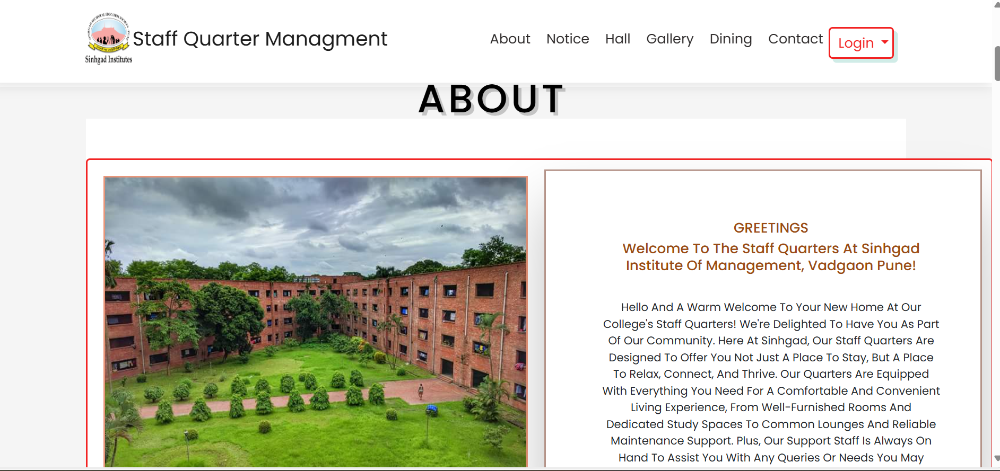
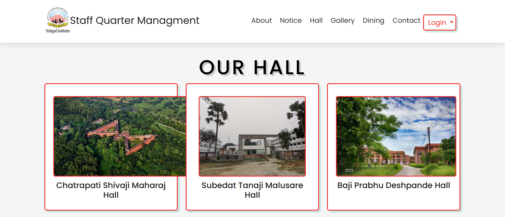
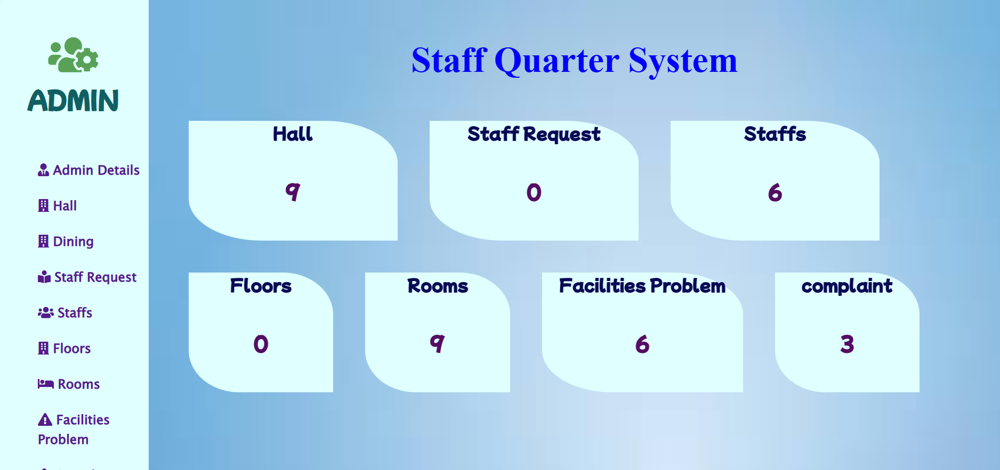

# Staff Quarter-Management-System

# ABSTRACT
This report describes the development of a Staff Quarter Management System website aimed at improving the efficiency and effectiveness of managing staff quarters. The system addresses challenges such as managing staff information, assigning quarters, tracking occupancy, and processing maintenance requests and billing details. The proposed solution offers features like user registration, login, quarter assignment, and automated record-keeping, making management more streamlined.  

The website was built using PHP and MySQL and underwent rigorous testing to ensure its reliability and usability. Results showed significant benefits for both staff and administrators, including reduced paperwork, better transparency, and smoother communication. The report concludes with recommendations for future enhancements, such as integrating additional functionalities like automated notifications or scalability for larger organizations. Overall, the Staff Quarter Management System has the potential to transform quarter allocation and management, benefiting both staff and administrators alike.

# Objectives
 The objectives of the “Staff Quarter Management System” are: 

To provide a digital management system for efficiently handling staff quarters at institutions. 
To develop a user-friendly, intuitive website accessible to both staff and administrators. 
To automate processes like quarter allocation, occupancy tracking, and request management. 
To reduce paperwork and administrative burden with a centralized, digital platform. 
To ensure accurate and up-to-date records of staff information and quarter assignments. 
To implement robust security measures to protect user data and maintain confidentiality. 
To offer scalability and reliability, accommodating future growth and updates. 
To improve staff experience by streamlining the quarter allocation process and ensuring timely maintenance. 

# Requirement Collection and Analysis
 The key modules in the system include: 

Administrator Module: Manages staff records, approves requests, assigns quarters, and monitors overall system activities. 
Staff Module: Allows staff members to log in, view their assigned quarters, and submit requests. 
Request Management Module: Handles requests related to quarter assignments, maintenance, and approvals. 
Notification Module: Sends notifications to staff regarding request approvals or updates. 

# Database Schema  
Admin (A_ID, Password) 
Staff (St_ID, Name, Phone, Email, Designation, Salary, Quarter_Assigned, Password) 
Quarter (Q_ID, Location, Type, Occupancy_Status, St_ID) 
Request (R_ID, Request_Type, Description, Status, St_ID, Admin_ID) 
Notification (N_ID, Message, Date, St_ID) 
Maintenance (M_ID, Issue, Resolution_Status, Assigned_Date, Resolved_Date, Q_ID) 

## Design

### Home Page

### About Page

### Hall Page

### Admin Home Page

# Conclusion  
The Staff Quarter Management System simplifies and automates the management of staff quarters in organizations. By centralizing processes such as staff registration, quarter assignment, and request handling, it reduces administrative workload and ensures better transparency and communication.  

Through automation, the system enhances the efficiency of quarter allocation and maintenance tracking, allowing administrators to focus on strategic tasks and improving staff satisfaction. Additionally, the system offers valuable insights into occupancy and request patterns, supporting data-driven decisions for resource optimization.  

The project demonstrates significant potential for future growth, such as integrating additional modules, enhancing scalability, or linking with existing institutional systems. Overall, the Staff Quarter Management System modernizes housing management practices, benefiting both administrators and staff.  

